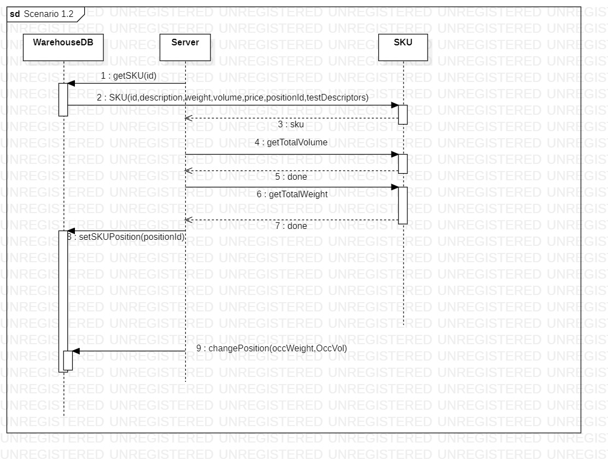
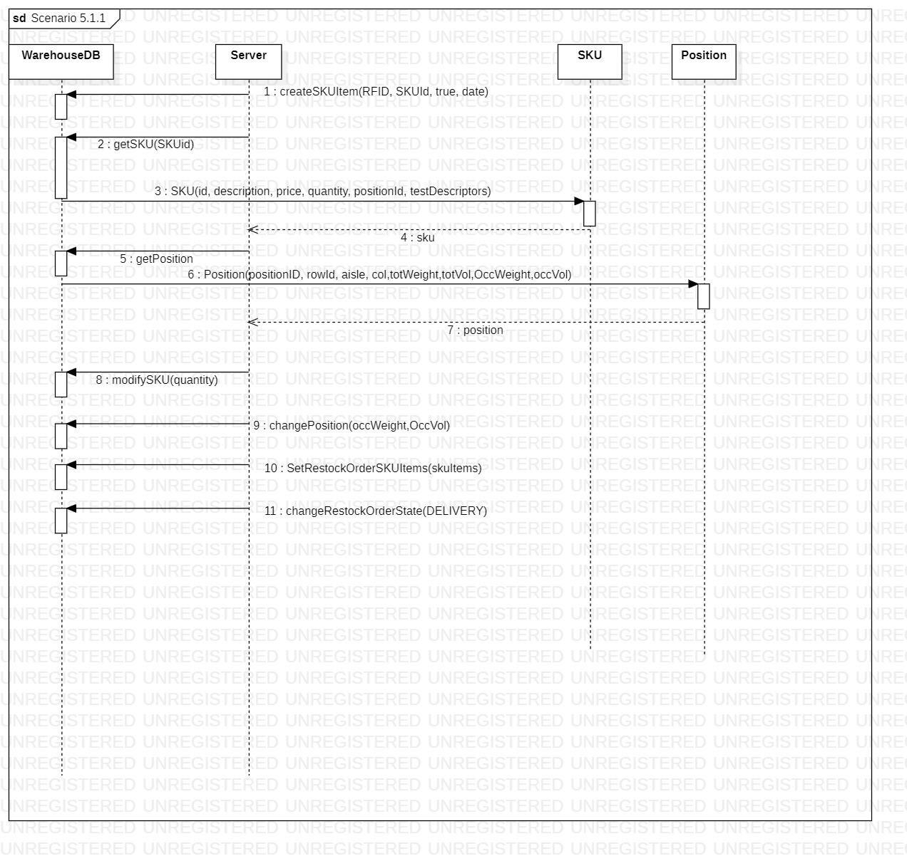
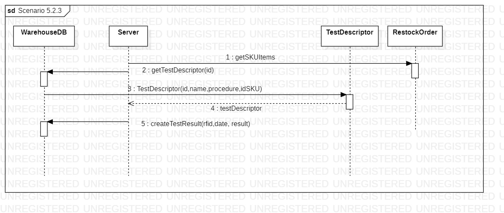
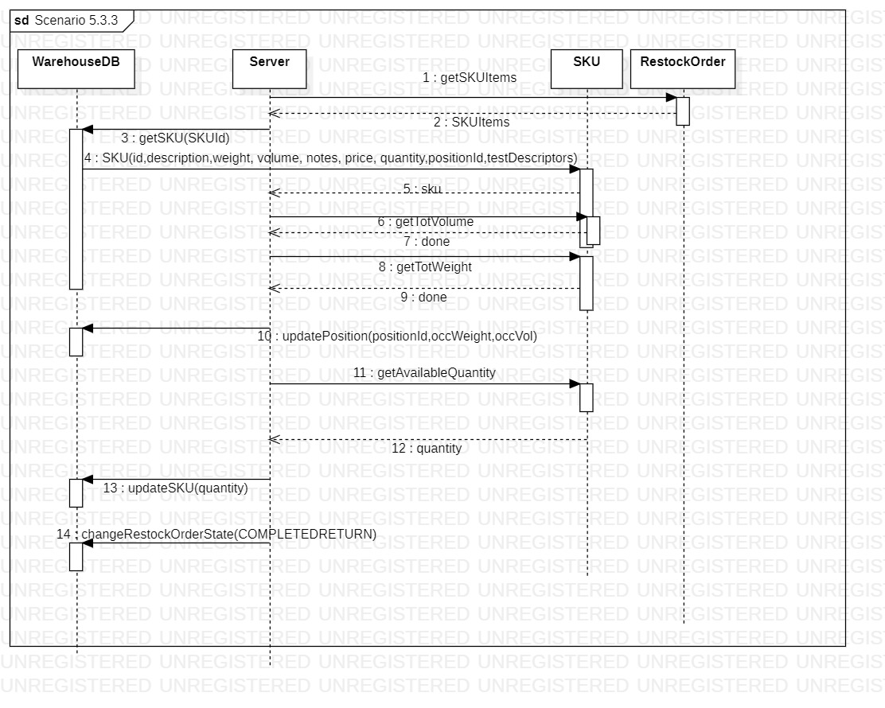
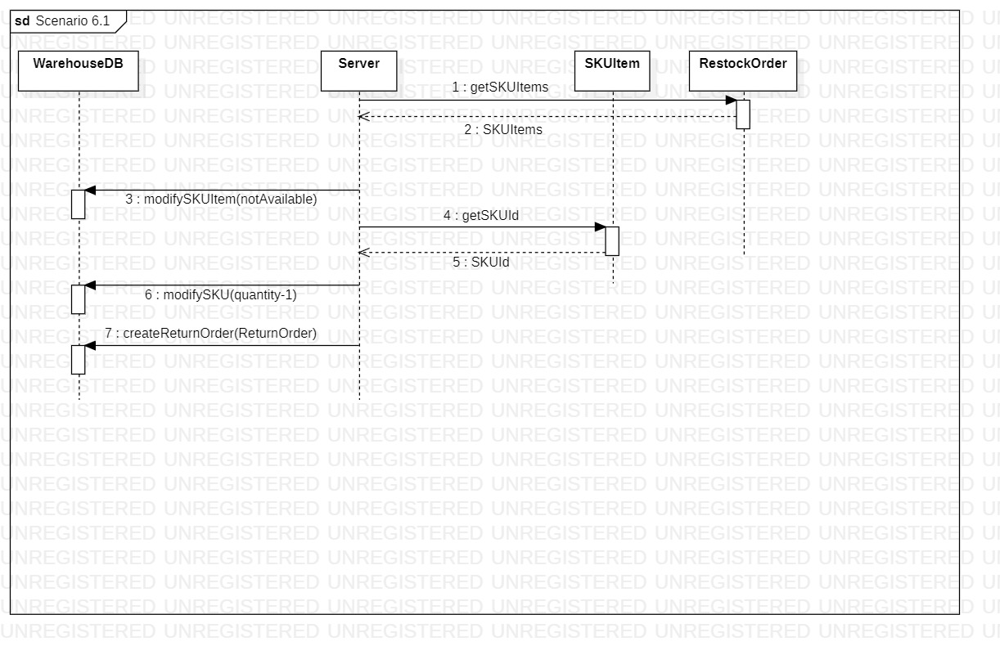
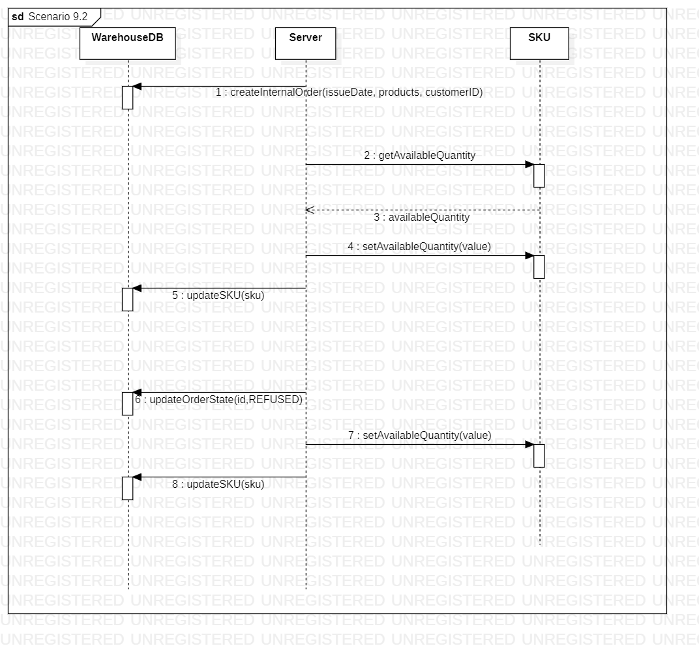
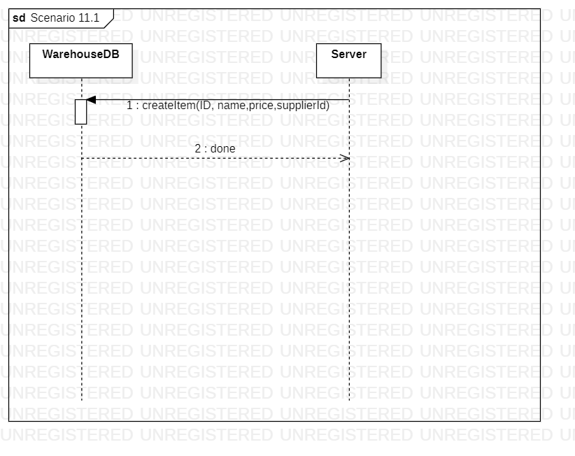

# Design Document 

Authors: 

Date:

Version:

 1.1 : Updated class diagram, "DatabaseHelper" renamed as "WarehouseDB", "DataImpl" renamed as "server" 

# Contents

- [High level design](#package-diagram)
- [Low level design](#class-diagram)
- [Verification traceability matrix](#verification-traceability-matrix)
- [Verification sequence diagrams](#verification-sequence-diagrams)

# Instructions

The design must satisfy the Official Requirements document, notably functional and non functional requirements, and be consistent with the APIs

# High level design 

The system is based on a central database that defines the data model, in a repository style. The architecture is also organized in a layered fashion, with the layers being the data on the database, the application logic and the GUI for the presentation/user interface.

# Low level design

EzWarehouse backend

The "server" class contains methods that mirror the APIs exposed to the front-end
# Verification traceability matrix

# Verification sequence diagrams 

In the scenarios that follow an iterative procedure, only a single iteration is shown

Scenario 1.2

Scenario 3.2

Scenario 5.1.1

Scenario 5.2.3

Scenario 5.3.3

Scenario 6.1

Scenario 9.2

Scenario 10.1

Scenario 11.1

Scenario 12.1

