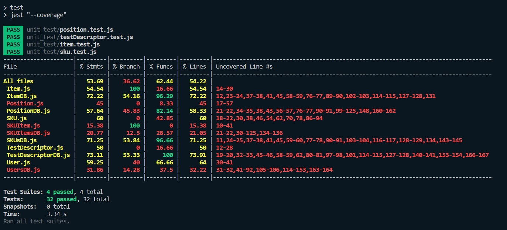

# Unit Testing Report

Date:

Version:

# Contents

- [Black Box Unit Tests](#black-box-unit-tests)

- [White Box Unit Tests](#white-box-unit-tests)

# Black Box Unit Tests

    <Define here criteria, predicates and the combination of predicates for each function of each class.
    Define test cases to cover all equivalence classes and boundary conditions.
    In the table, report the description of the black box test case and (traceability) the correspondence with the Jest test case writing the 
    class and method name that contains the test case>
    <Jest tests  must be in code/server/unit_test  >

 
 
 
  ### **Class *ItemDB* - method *getItemById***

**Criteria for method *getItemById*:**
	
Checks are done on the upper layer:
 - Range of ID

**Predicates for method *getItemById*:**

| Criteria | Predicate |
| -------- | --------- |
|     Range of ID     |     i >= 0      |

**Boundaries**:

| Criteria | Boundary values |
| -------- | --------------- |
|     Range of ID     |        i >= 0         |
|          |        i < 0         |

**Combination of predicates**:

| Range of ID | Valid/Invalid | Description of the test case | Jest test case |
|-------|-------|-------|-------|
| i >= 0 | Valid | T1(1111;Item Returned) | testModifyItem

### **Class *ItemDB* - method *createItem***

**Criteria for method *createItem*:**
	
Checks are done on the upper layer:
 - ID Range
 - Item Description
 - Price Range
 - SKU ID Range
 - Supplier ID Range

**Predicates for method *createItem*:**

| Criteria | Predicate |
| -------- | --------- |
|     ID Range     |     i >= 0      |
|     Item Description     |     WF      |
|     Price Range     |     p >= 0      |
|     SKU ID Range     |     k >= 0      |
|     Supplier ID Range     |     s >= 0      |

**Boundaries**:

| Criteria | Boundary values |
| -------- | --------------- |
|     ID Range     |        i >= 0         |
|          |        i < 0         |
|     Item Description     |        WF         |
|          |        not WF         |
|     Price Range     |        p >= 0         |
|          |        p < 0         |
|     SKU ID Range     |        k >= 0         |
|          |        k < 0         |
|     Supplier ID Range     |        s >= 0         |
|          |        s < 0         |

**Combination of predicates**:

| ID Range | Item Description | Price Range | SKU ID Range | Supplier ID Range | Valid/Invalid | Description of the test case | Jest test case |
|-------|-------|-------|-------|-------|-------|-------|-------|
| i >= 0 | WF | p >= 0 | k >= 0 | s >= 0 | Valid | T1(11,"des",4.4,2,33;Item Created) | testNewItem |
|        |    |        |        | s < 0 | Invalid | T2(11,"des",4.4,2,-33;error) |  |
|        |    |        | k < 0 | s >= 0 | Invalid | T3(11,"des",4.4,-2,33;error) |  |
|        |    |        |        | s < 0 | Invalid | T4(11,"des",4.4,-2,-33;error) |  |
|        |    | p < 0 | k >= 0 | s >= 0 | Invalid | T5(11,"des",-4.4,2,33;error) |  |
|        |    |        |        | s < 0 | Invalid | T6(11,"des",-4.4,2,-33;error) |  |
|        |    |        | k < 0 | s >= 0 | Invalid | T7(11,"des",-4.4,-2,33;error) |  |
|        |    |        |        | s < 0 | Invalid | T8(11,"des",-4.4,-2,-33;error) |  |
|        | not WF | p >= 0 | k >= 0 | s >= 0 | Invalid | T9(11,4.4,2,33;Item Created) |  |
|        |    |        |        | s < 0 | Invalid | T10(11,4.4,2,-33;error) |  |
|        |    |        | k < 0 | s >= 0 | Invalid | T11(11,4.4,-2,33;error) |  |
|        |    |        |        | s < 0 | Invalid | T12(11,4.4,-2,-33;error) |  |
|        |    | p < 0 | k >= 0 | s >= 0 | Invalid | T13(11,-4.4,2,33;error) |  |
|        |    |        |        | s < 0 | Invalid | T14(11,-4.4,2,-33;error) |  |
|        |    |        | k < 0 | s >= 0 | Invalid | T15(11,-4.4,-2,33;error) |  |
|        |    |        |        | s < 0 | Invalid | T16(11,-4.4,-2,-33;error) |  |
| i < 0 | WF | p >= 0 | k >= 0 | s >= 0 | Invalid | T17(-11,4.4,2,33;error) |  |
|        |    |        |        | s < 0 | Invalid | T18(-11,"des",4.4,2,-33;error) |  |
|        |    |        | k < 0 | s >= 0 | Invalid | T19(-11,"des",4.4,-2,33;error) |  |
|        |    |        |        | s < 0 | Invalid | T20(-11,"des",4.4,-2,-33;error) |  |
|        |    | p < 0 | k >= 0 | s >= 0 | Invalid | T21(-11,"des",-4.4,2,33;error) |  |
|        |    |        |        | s < 0 | Invalid | T22(-11,"des",-4.4,2,-33;error) |  |
|        |    |        | k < 0 | s >= 0 | Invalid | T23(-11,"des",-4.4,-2,33;error) |  |
|        |    |        |        | s < 0 | Invalid | T24(-11,"des",-4.4,-2,-33;error) |  |
|        | not WF | p >= 0 | k >= 0 | s >= 0 | Invalid | T25(-11,22,4.4,2,33;error) |  |
|        |    |        |        | s < 0 | Invalid | T26(-11,22,4.4,2,-33;error) |  |
|        |    |        | k < 0 | s >= 0 | Invalid | T27(-11,22,4.4,-2,33;error) |  |
|        |    |        |        | s < 0 | Invalid | T28(-11,22,4.4,-2,-33;error) |  |
|        |    | p < 0 | k >= 0 | s >= 0 | Invalid | T29(-11,22,-4.4,2,33;error) |  |
|        |    |        |        | s < 0 | Invalid | T30(-11,22,-4.4,2,-33;error) |  |
|        |    |        | k < 0 | s >= 0 | Invalid | T31(-11,22,-4.4,-2,33;error) |  |
|        |    |        |        | s < 0 | Invalid | T32(-11,22,-4.4,-2,-33;error) |  |

 
 ### **Class *ItemDB* - method *changeItem***

**Criteria for method *changeItem*:**
	
Checks are done on the upper layer:
 - ID Range
 - Old ID Range
 - Item Description
 - Price Range
 - SKU ID Range
 - Supplier ID Range

**Predicates for method *changeItem*:**

| Criteria | Predicate |
| -------- | --------- |
|     ID Range     |     i >= 0      |
|     Old ID Range     |     i >= 0      |
|     Item Description     |     WF      |
|     Price Range     |     p >= 0      |
|     SKU ID Range     |     k >= 0      |
|     Supplier ID Range     |     s >= 0      |

**Boundaries**:

| Criteria | Boundary values |
| -------- | --------------- |
|     ID Range     |        i >= 0         |
|          |        i < 0         |
|     Old ID Range     |        i >= 0         |
|          |        i < 0         |
|     Item Description     |        WF         |
|          |        not WF         |
|     Price Range     |        p >= 0         |
|          |        p < 0         |
|     SKU ID Range     |        k >= 0         |
|          |        k < 0         |
|     Supplier ID Range     |        s >= 0         |
|          |        s < 0         |

**Combination of predicates**:

| ID Range | Old ID Range | Item Description | Price Range | SKU ID Range | Supplier ID Range | Valid/Invalid | Description of the test case | Jest test case |
|-------|-------|-------|-------|-------|-------|-------|-------|-------|
| i >= 0 | o >= 0 | WF | p >= 0 | k >= 0 | s >= 0 | Valid | T1(11,2,"des",4.4,2,33;Item Created) | testModifyItem |
|        |        |    |        |        | s < 0 | Invalid | T2(11,2,"des",4.4,2,-33;error) |  |
|        |        |    |        | k < 0 | s >= 0 | Invalid | T3(11,2,"des",4.4,-2,33;error) |  |
|        |        |    |        |        | s < 0 | Invalid | T4(11,2,"des",4.4,-2,-33;error) |  |
|        |        |    | p < 0 | k >= 0 | s >= 0 | Invalid | T5(11,2,"des",-4.4,2,33;error) |  |
|        |        |    |        |        | s < 0 | Invalid | T6(11,2,"des",-4.4,2,-33;error) |  |
|        |        |    |        | k < 0 | s >= 0 | Invalid | T7(11,2,"des",-4.4,-2,33;error) |  |
|        |        |    |        |        | s < 0 | Invalid | T8(11,2,"des",-4.4,-2,-33;error) |  |
|        |        | not WF | p >= 0 | k >= 0 | s >= 0 | Invalid | T1(11,2,22,4.4,2,33;Item Created) |  |
|        |        |    |        |        | s < 0 | Invalid | T2(11,2,22,4.4,2,-33;error) |  |
|        |        |    |        | k < 0 | s >= 0 | Invalid | T3(11,2,22,4.4,-2,33;error) |  |
|        |        |    |        |        | s < 0 | Invalid | T4(11,2,22,2,22,4.4,-2,-33;error) |  |
|        |        |    | p < 0 | k >= 0 | s >= 0 | Invalid | T5(11,2,22,-4.4,2,33;error) |  |
|        |        |    |        |        | s < 0 | Invalid | T6(11,2,22,-4.4,2,-33;error) |  |
|        |        |    |        | k < 0 | s >= 0 | Invalid | T7(11,2,22,-4.4,-2,33;error) |  |
|        |        |    |        |        | s < 0 | Invalid | T8(11,2,22,-4.4,-2,-33;error) |  |
|        | o < 0 | WF | p >= 0 | k >= 0 | s >= 0 | Valid | T1(11,-2,"des",4.4,2,33;Item Created) |  |
|        |        |    |        |        | s < 0 | Invalid | T2(11,-2,"des",4.4,2,-33;error) |  |
|        |        |    |        | k < 0 | s >= 0 | Invalid | T3(11,-2,"des",4.4,-2,33;error) |  |
|        |        |    |        |        | s < 0 | Invalid | T4(11,-2,"des",4.4,-2,-33;error) |  |
|        |        |    | p < 0 | k >= 0 | s >= 0 | Invalid | T5(11,-2,"des",-4.4,2,33;error) |  |
|        |        |    |        |        | s < 0 | Invalid | T6(11,-2,"des",-4.4,2,-33;error) |  |
|        |        |    |        | k < 0 | s >= 0 | Invalid | T7(11,-2,"des",-4.4,-2,33;error) |  |
|        |        |    |        |        | s < 0 | Invalid | T8(11,-2,"des",-4.4,-2,-33;error) |  |
|        |        | not WF | p >= 0 | k >= 0 | s >= 0 | Invalid | T1(11,-2,"des",4.4,2,33;Item Created) |  |
|        |        |    |        |        | s < 0 | Invalid | T2(11,-2,"des",4.4,2,-33;error) |  |
|        |        |    |        | k < 0 | s >= 0 | Invalid | T3(11,-2,"des",4.4,-2,33;error) |  |
|        |        |    |        |        | s < 0 | Invalid | T4(11,-2,"des",4.4,-2,-33;error) |  |
|        |        |    | p < 0 | k >= 0 | s >= 0 | Invalid | T5(11,-2,"des",-4.4,2,33;error) |  |
|        |        |    |        |        | s < 0 | Invalid | T6(11,-2,"des",-4.4,2,-33;error) |  |
|        |        |    |        | k < 0 | s >= 0 | Invalid | T7(11,-2,"des",-4.4,-2,33;error) |  |
|        |        |    |        |        | s < 0 | Invalid | T8(11,-2,"des",-4.4,-2,-33;error) |  |
| i < 0 | o >= 0 | WF | p >= 0 | k >= 0 | s >= 0 | Valid | T1(-11,2,"des",4.4,2,33;Item Created) |  |
|        |        |    |        |        | s < 0 | Invalid | T2(-11,2,"des",4.4,2,-33;error) |  |
|        |        |    |        | k < 0 | s >= 0 | Invalid | T3(-11,2,"des",4.4,-2,33;error) |  |
|        |        |    |        |        | s < 0 | Invalid | T4(-11,2,"des",4.4,-2,-33;error) |  |
|        |        |    | p < 0 | k >= 0 | s >= 0 | Invalid | T5(-11,2,"des",-4.4,2,33;error) |  |
|        |        |    |        |        | s < 0 | Invalid | T6(-11,2,"des",-4.4,2,-33;error) |  |
|        |        |    |        | k < 0 | s >= 0 | Invalid | T7(-11,2,"des",-4.4,-2,33;error) |  |
|        |        |    |        |        | s < 0 | Invalid | T8(-11,2,"des",-4.4,-2,-33;error) |  |
|        |        | not WF | p >= 0 | k >= 0 | s >= 0 | Invalid | T1(-11,2,22,4.4,2,33;Item Created) |  |
|        |        |    |        |        | s < 0 | Invalid | T2(-11,2,22,4.4,2,-33;error) |  |
|        |        |    |        | k < 0 | s >= 0 | Invalid | T3(-11,2,22,4.4,-2,33;error) |  |
|        |        |    |        |        | s < 0 | Invalid | T4(-11,2,22,2,22,4.4,-2,-33;error) |  |
|        |        |    | p < 0 | k >= 0 | s >= 0 | Invalid | T5(-11,2,22,-4.4,2,33;error) |  |
|        |        |    |        |        | s < 0 | Invalid | T6(-11,2,22,-4.4,2,-33;error) |  |
|        |        |    |        | k < 0 | s >= 0 | Invalid | T7(-11,2,22,-4.4,-2,33;error) |  |
|        |        |    |        |        | s < 0 | Invalid | T8(-11,2,22,-4.4,-2,-33;error) |  |
|        | o < 0 | WF | p >= 0 | k >= 0 | s >= 0 | Valid | T1(-11,-2,"des",4.4,2,33;Item Created) |  |
|        |        |    |        |        | s < 0 | Invalid | T2(-11,-2,"des",4.4,2,-33;error) |  |
|        |        |    |        | k < 0 | s >= 0 | Invalid | T3(-11,-2,"des",4.4,-2,33;error) |  |
|        |        |    |        |        | s < 0 | Invalid | T4(-11,-2,"des",4.4,-2,-33;error) |  |
|        |        |    | p < 0 | k >= 0 | s >= 0 | Invalid | T5(-11,-2,"des",-4.4,2,33;error) |  |
|        |        |    |        |        | s < 0 | Invalid | T6(-11,-2,"des",-4.4,2,-33;error) |  |
|        |        |    |        | k < 0 | s >= 0 | Invalid | T7(-11,-2,"des",-4.4,-2,33;error) |  |
|        |        |    |        |        | s < 0 | Invalid | T8(-11,-2,"des",-4.4,-2,-33;error) |  |
|        |        | not WF | p >= 0 | k >= 0 | s >= 0 | Invalid | T1(-11,-2,"des",4.4,2,33;Item Created) |  |
|        |        |    |        |        | s < 0 | Invalid | T2(-11,-2,"des",4.4,2,-33;error) |  |
|        |        |    |        | k < 0 | s >= 0 | Invalid | T3(-11,-2,"des",4.4,-2,33;error) |  |
|        |        |    |        |        | s < 0 | Invalid | T4(-11,-2,"des",4.4,-2,-33;error) |  |
|        |        |    | p < 0 | k >= 0 | s >= 0 | Invalid | T5(-11,-2,"des",-4.4,2,33;error) |  |
|        |        |    |        |        | s < 0 | Invalid | T6(-11,-2,"des",-4.4,2,-33;error) |  |
|        |        |    |        | k < 0 | s >= 0 | Invalid | T7(-11,-2,"des",-4.4,-2,33;error) |  |
|        |        |    |        |        | s < 0 | Invalid | T8(-11,-2,"des",-4.4,-2,-33;error) |  |
 
 
 
 ### **Class *ItemDB* - method *deleteItem***

**Criteria for method *deleteItem*:**
	
Checks are done on the upper layer:
 - Range of ID

**Predicates for method *deleteItem*:**

| Criteria | Predicate |
| -------- | --------- |
|     Range of ID     |     i >= 0      |

**Boundaries**:

| Criteria | Boundary values |
| -------- | --------------- |
|     Range of ID     |        i >= 0         |
|          |        i < 0         |

**Combination of predicates**:

| Range of ID | Valid/Invalid | Description of the test case | Jest test case |
|-------|-------|-------|-------|
| i >= 0 | Valid | T1("1111";Item Deleted) | testDeleteItem
| i < 0 | Invalid | T2(-1111;error) |
 
 
  

 ### **Class *PositionDB* - method *getPosition***

**Criteria for method *getPosition*:**
Checks are done on the upper layer:
 - Position ID Length

**Predicates for method *getPosition*:**

| Criteria | Predicate |
| -------- | --------- |
|     Position ID Length     |     p = 12      |

**Boundaries**:

| Criteria | Boundary values |
| -------- | --------------- |
|     Position ID Length     |        p = 12         |
|          |        p != 12         |

**Combination of predicates**:

| ID Length | Valid/Invalid | Description of the test case | Jest test case |
|-------|-------|-------|-------|
| i = 12 | Valid | T3("111122223333";"1111","2222","3333","maxWeight","maxVolume","occupiedWeight","occupiedVolume",) | testGetPositionById
| i != 12 | Invalid | T1("1111222233334";error) |

 ### **Class *PositionDB* - method *createPosition***

**Criteria for method *createPosition*:**
	
Checks are done on the upper layer:
 - aisle ID Length
 - row Length
 - col Length
 - Max. Weight
 - Max. Volume

**Predicates for method *createPosition*:**

| Criteria | Predicate |
| -------- | --------- |
|     aisleID Length     |     a = 4      |
|     row Length     |     r = 4      |
|     col Length     |     c = 4      |
|     Max. Weight     |     w > 0      |
|     Max. Volume     |     v > 0      |

**Boundaries**:

| Criteria | Boundary values |
| -------- | --------------- |
| aisleID Length | a != 4 |
|          |        a = 4         |
| row Length |        r != 4         |
|          |        r = 4        |
| col Length |        c != 4         |
|          |        c = 4         |
|     Max. Weight     |     w > 0      |
|          |     w <= 0      |
|     Max. Volume     |     v > 0      |
|          |     v <= 0      |

**Combination of predicates**:

| aisleID Length | row | col | maxWeight | maxVol | Valid/Invalid | Description of the test case | Jest test case |
|-------|-------|-------|-------|-------|-------|-------|-------|
| a = 4 | r = 4 | c = 4 | w <= 0 | v <= 0 | Invalid | T1("1111","2222","3333";error) | testNewPosition |
|       |       |       |        | v > 0 | Invalid | T1("1111","2222","3333";error) |       |
|       |       |       | w > 0 | v <= 0 | Invalid | T1("1111","2222","3333";error) |       |
|       |       |       |        | v > 0 | Valid | T1("1111","2222","3333";"111122223333",maxWeight,maxVolume) ) |       |
|       |       | c != 4 | w <= 0 | v <= 0 | Invalid | T1("1111","2222","33334";error) |       |
|       |       |       |        | v > 0 | Invalid | T1("1111","2222","33334";error) |       |
|       |       |       | w > 0 | v <= 0 | Invalid | T1("1111","2222","333";error) |       |
|       |       |       |        | v > 0 | Invalid | T1("1111","2222","333";error) |       |
|       | r != 4 | c = 4 | w <= 0 | v <= 0 | Invalid | T1("1111","2223","3333";error) |       |
|       |       |       |        | v > 0 | Invalid | T1("1111","222","3333";error) |       |
|       |       |       | w > 0 | v <= 0 | Invalid | T1("1111","22223","3333";error) |       |
|       |       |       |        | v > 0 | Invalid | T1("1111","222","3333";error) |       |
|       |       | c != 4 | w <= 0 | v <= 0 | Invalid | T1("1111","22223","33334";error) |       |
|       |       |       |        | v > 0 | Invalid | T1("1111","222","33334";error) |       |
|       |       |       | w > 0 | v <= 0 | Invalid | T1("1111","22223","333";error) |       |
|       |       |       |        | v > 0 | Invalid | T1("1111","222","333";error) |       |
| a != 4 | r = 4 | c = 4 | w <= 0 | v <= 0 | Invalid | T1("11112","2222","3333";error) |       |
|       |       |       |        | v > 0 | Invalid | T1("111","2222","3333";error) |       |
|       |       |       | w > 0 | v <= 0 | Invalid | T1("11112","2222","3333";error) |       |
|       |       |       |        | v > 0 | Invalid | T1("111","2222","3333";"111122223333",maxWeight,maxVolume) ) |       |
|       |       | c != 4 | w <= 0 | v <= 0 | Invalid | T1("11112","2222","33334";error) |       |
|       |       |       |        | v > 0 | Invalid | T1("111","2222","33334";error) |       |
|       |       |       | w > 0 | v <= 0 | Invalid | T1("11112","2222","333";error) |       |
|       |       |       |        | v > 0 | Invalid | T1("111","2222","333";error) |       |
|       | r != 4 | c = 4 | w <= 0 | v <= 0 | Invalid | T1("11112","2223","3333";error) |       |
|       |       |       |        | v > 0 | Invalid | T1("111","222","3333";error) |       |
|       |       |       | w > 0 | v <= 0 | Invalid | T1("11112","22223","3333";error) |       |
|       |       |       |        | v > 0 | Invalid | T1("111","222","3333";error) |       |
|       |       | c != 4 | w <= 0 | v <= 0 | Invalid | T1("11112","22223","33334";error) |       |
|       |       |       |        | v > 0 | Invalid | T1("111","222","33334";error) |       |
|       |       |       | w > 0 | v <= 0 | Invalid | T1("11112","22223","333";error) |       |
|       |       |       |        | v > 0 | Invalid | T1("1111","222","333";error) |       |

 ### **Class *PositionDB* - method *changePosition***

**Criteria for method *changePosition*:**
	
Checks are done on the upper layer:
 - position ID Length
 - aisle ID Length
 - row Length
 - col Length
 - Max. Weight
 - Max. Volume

**Predicates for method *changePosition*:**

| Criteria | Predicate |
| -------- | --------- |
|     positionID Length     |     p = 12      |
|     aisleID Length     |     a = 4      |
|     row Length     |     r = 4      |
|     col Length     |     c = 4      |
|     Max. Weight     |     w > 0      |
|     Max. Volume     |     v > 0      |

**Boundaries**:

| Criteria | Boundary values |
| -------- | --------------- |
| positionID Length | p != 12 |
|          |        p = 12         |
| aisleID Length | a != 4 |
|          |        a = 4         |
| row Length |        r != 4         |
|          |        r = 4        |
| col Length |        c != 4         |
|          |        c = 4         |
| Max. Weight | p != 12 |
|          |        p = 12         |
| Max. Volume | a != 4 |
|          |        a = 4         |

**Combination of predicates**:

| positionID | aisleID Length | row | col | Max. Weight | Max. Volume | Valid/Invalid | Description of the test case | Jest test case |
|-------|-------|-------|-------|-------|-------|-------|-------|-------|
| p != 12 | a != 4 | r != 4 | c != 4 | w > 0 | v > 0 | Invalid | T1("1111222233334","11111,"22222","33333";error) |  testModifyPosition  |
||        |        |        |        | v <= 0 | Invalid | T2("1111222233334","11111,"22222","33333";error) |       |
||         |        |        | w <= 0 | v > 0 | Invalid | T3("1111222233334","11111,"22222","33333";error) |       |
||         |        |        |        | v <= 0 | Invalid | T4("1111222233334","11111,"22222","33333";error) |       |
||         |       | c = 4 | w > 0 | v > 0 | Invalid | T5("1111222233334","11111","22222","3333";error) |       |
||         |       |       |       | v <= 0 | Invalid | T6("1111222233334","11111","22222","3333";error) |       |
||        |        |        | w <= 0 | v > 0 | Invalid | T7("1111222233334","11111,"22222","3333";error) |       |
||        |        |        |        | v <= 0 | Invalid | T8("1111222233334","11111,"22222","3333";error) |       |
||        | r = 4 | c != 4 | w > 0 | v > 0 | Invalid | T9("1111222233334","11112,"2222","33333";error) |       |
||        |       |        | w > 0 | v <= 0 | Invalid | T10("1111222233334","11111,"2222","33333";error) |       |
||         |        |        | w <= 0 | v > 0 | Invalid | T11("1111222233334","11111,"2222","33333";error) |       |
||         |        |        | w <= 0 | v <= 0 | Invalid | T11("1111222233334","11111,"2222","33333";error) |       |
||         |       | c = 4 | w > 0 | v > 0 | Invalid | T13("1111222233334","11111","2222","3333";error) |       |
||         |       |       |       | v <= 0 | Invalid | T14("1111222233334","11111","2222","3333";error) |       |
||        |        |        | w <= 0 | v > 0 | Invalid | T15("1111222233334","11111,"2222","3333";error) |       |
||        |        |        |        | v <= 0 | Invalid | T16("1111222233334","11111,"2222","3333";error) |       |
|| a = 4 | r != 4 | c != 4 | w > 0 | v > 0 | Invalid | T17("1111222233334","1111,"22222","33333";error") |       |
||        |        |        |        | v <= 0 | Invalid | T18("1111222233334","1111,"22222","33333";error) |       |
||         |        |        | w <= 0 | v > 0 | Invalid | T19("1111222233334","1111,"22222","33333";error) |       |
||         |        |        |        | v <= 0 | Invalid | T20("1111222233334","1111,"22222","33333";error) |       |
||         |       | c = 4 | w > 0 | v > 0 | Invalid | T21("1111222233334","1111","22222","3333";error) |       |
||         |       |       |       | v <= 0 | Invalid | T22("1111222233334","1111","22222","3333";error) |       |
||        |        |        | w <= 0 | v > 0 | Invalid | T23("1111222233334","1111,"22222","3333";error) |       |
||        |        |        |        | v <= 0 | Invalid | T24("1111222233334","1111,"22222","3333";error) |       |
||        | r = 4 | c != 4 | w > 0 | v > 0 | Invalid | T25("1111222233334","1111,"2222","33333";error) |       |
||        |       |        | w > 0 | v <= 0 | Invalid | T26("1111222233334","1111,"2222","33333";error) |       |
||         |        |        | w <= 0 | v > 0 | Invalid | T27("1111222233334","1111,"2222","33333";error) |       |
||         |        |        | w <= 0 | v <= 0 | Invalid | T28("1111222233334","1111,"2222","33333";error) |       |
||         |       | c = 4 | w > 0 | v > 0 | Invalid | T29("1111222233334","1111","2222","3333";error) |       |
||         |       |       |       | v <= 0 | Invalid | T30("1111222233334","1111","2222","3333";error) |       |
||        |        |        | w <= 0 | v > 0 | Invalid | T31("1111222233334","1111,"2222","3333";error) |       |
||        |        |        |        | v <= 0 | Invalid | T32("1111222233334","1111,"2222","3333";error) |       |
| p = 12 | a != 4 | r != 4 | c != 4 | w > 0 | v > 0 | Invalid | T33("111122223333","11112,"22223","33334";error) |       |
||        |        |        |        | v <= 0 | Invalid | T34("111122223333","11112,"22223","33334";error) |       |
||         |        |        | w <= 0 | v > 0 | Invalid | T35("111122223333","11112,"22223","33334";error) |       |
||         |        |        |        | v <= 0 | Invalid | T36("111122223333","11112,"22223","33334";error) |       |
||         |       | c = 4 | w > 0 | v > 0 | Invalid | T37("111122223333","11112","22223","3333";error) |       |
||         |       |       |       | v <= 0 | Invalid | T38("111122223333","11112","22223","3333";error) |       |
||        |        |        | w <= 0 | v > 0 | Invalid | T39("111122223333","11112,"22223","3333";error) |       |
||        |        |        |        | v <= 0 | Invalid | T40("111122223333","11112,"22223","3333";error) |       |
||        | r = 4 | c != 4 | w > 0 | v > 0 | Invalid | T41("111122223333","11112,"2222","33334";error) |       |
||        |       |        | w > 0 | v <= 0 | Invalid | T42("111122223333","11112,"2222","33334";error) |       |
||         |        |        | w <= 0 | v > 0 | Invalid | T43("111122223333","11112,"2222","33334";error) |       |
||         |        |        | w <= 0 | v <= 0 | Invalid | T44("111122223333","11112,"2222","33334";error) |       |
||         |       | c = 4 | w > 0 | v > 0 | Invalid | T45("111122223333","11112","2222","3333";error) |       |
||         |       |       |       | v <= 0 | Invalid | T46("111122223333","11112","2222","3333";error) |       |
||        |        |        | w <= 0 | v > 0 | Invalid | T47("111122223333","11112,"2222","3333";error) |       |
||        |        |        |        | v <= 0 | Invalid | T48("111122223333","11112,"2222","3333";error) |       |
|| a = 4 | r != 4 | c != 4 | w > 0 | v > 0 | Invalid | T49("111122223333","1111,"22222","33333";error) |       |
||        |        |        |        | v <= 0 | Invalid | T50("111122223333","1111,"22222","33333";error) |       |
||         |        |        | w <= 0 | v > 0 | Invalid | T51("111122223333","1111,"22222","33333";error) |       |
||         |        |        |        | v <= 0 | Invalid | T52("111122223333","1111,"22222","33333";error) |       |
||         |       | c = 4 | w > 0 | v > 0 | Invalid | T53("111122223333","1111","22222","3333";error) |       |
||         |       |       |       | v <= 0 | Invalid | T54("111122223333","1111","22222","3333";error) |       |
||        |        |        | w <= 0 | v > 0 | Invalid | T55("111122223333","1111,"22222","3333";error) |       |
||        |        |        |        | v <= 0 | Invalid | T56("111122223333","1111,"22222","3333";error) |       |
||        | r = 4 | c != 4 | w > 0 | v > 0 | Invalid | T57("11122223333","1111,"2222","33333";error) |       |
||        |       |        | w > 0 | v <= 0 | Invalid | T58("111122223333","1111,"2222","33333";error) |       |
||         |        |        | w <= 0 | v > 0 | Invalid | T59("111122223333","1111,"2222","33333";error) |       |
||         |        |        | w <= 0 | v <= 0 | Invalid | T60("111122223333","1111,"2222","33333";error) |       |
||         |       | c = 4 | w > 0 | v > 0 | Valid | T61("111122223333","1111","2222","3333";Position Changed) |       |
||         |       |       |       | v <= 0 | Invalid | T62("111122223333","1111","2222","3333";error) |       |
||        |        |        | w <= 0 | v > 0 | Invalid | T63("111122223333","1111,"2222","3333";error) |       |
||        |        |        |        | v <= 0 | Invalid | T64("111122223333","1111,"2222","3333";error) |       |

 ### **Class *PositionDB* - method *changePositionID***

**Criteria for method *changePositionID*:**
Checks are done on the upper layer:
 - position ID Length
 - new Position ID Length

**Predicates for method *changePositionID*:**

| Criteria | Predicate |
| -------- | --------- |
|     Position ID Length     |     p = 12      |
|     New Position ID Length     |     n = 12      |

**Boundaries**:

| Criteria | Boundary values |
| -------- | --------------- |
|     positionID Length     |        p > 12         |
|          |        p < 12         |
|          |        p = 12         |
|     newPositionID Length     |        n > 12         |
|          |        n < 12         |
|          |        n = 12         |

**Combination of predicates**:

| positionID Length | newPositionID Length | Valid/Invalid | Description of the test case | Jest test case |
|-------|-------|-------|-------|-------|
| p > 12 | n > 12 | Invalid | T1("1111222233334","1111222244445";error) | testChangePosition
|| n < 12 | Invalid | T2("1111222233334","11112222444";error) |
|| n = 12 | Invalid | T3("1111222233334","111122224444";error) |
| p < 12 | n > 12 | Invalid | T4("11112222333","1111222244445";error) |
|| n < 12 | Invalid | T5("11112222333","11112222444";error) |
|| n = 12 | Invalid | T6("11112222333","111122224444";error) |
| p = 12 | n > 12 | Invalid | T4("111122223333","1111222244445";error) |
|| n < 12 | Invalid | T5("111122223333","11112222444";error) |
|| n = 12 | Valid | T6("111122223333","111122224444";"111122224444") |

 ### **Class *PositionDB* - method *deletePosition***

**Criteria for method *deletePosition*:**
	
Checks are done on the upper layer:
 - Position ID Length

**Predicates for method *deletePosition*:**

| Criteria | Predicate |
| -------- | --------- |
|     Position ID Length     |     p = 12      |

**Boundaries**:

| Criteria | Boundary values |
| -------- | --------------- |
|     Position ID Length     |        p > 12         |
|          |        p = 12         |
|          |        p < 12         |

**Combination of predicates**:

| Position ID Length | Valid/Invalid | Description of the test case | Jest test case |
|-------|-------|-------|-------|
| p > 12 | Invalid | T1("1111222233334";error) | testDeletePosition
| p < 12 | Invalid | T2("11112222333";error) |
| p = 12 | Valid | T3("111122223333";Position Deleted) |

 ### **Class *SKUsDB* - method *createSKU***

**Criteria for method *createSKU*:**
	
Checks are done on the upper layer:
 - Description
 - Weight
 - Volume
 - Notes
 - Price
 - Available Quantity

**Predicates for method *createSKU*:**

| Criteria | Predicate |
| -------- | --------- |
|     Description     |     WF      |
|     Weight     |     w >= 0      |
|     Volume     |     v >= 0      |
|     Notes     |     WF      |
|     Price     |     p >= 0      |
|     Available Quantity     |     q >= 0      |

**Boundaries**:

| Criteria | Boundary values |
| -------- | --------------- |
|     Description     |     WF      |
|          |     WF      |
|     Weight     |     w >= 0      |
|          |     w < 0      |
|     Volume     |     v >= 0      |
|          |     v < 0      |
|     Notes     |     WF      |
|          |     WF      |
|     Price     |     p >= 0      |
|          |     p < 0      |
|     Available Quantity     |     q >= 0      |
|          |     q < 0      |

**Combination of predicates**:

| Description | Weight | Volume | Notes | Price | Available Quantity | Description of the test case | Jest test case |
|-------|-------|-------|-------|-------|-------|-------|-------|
|   WF  | w >= 0 | v >= 0 |   WF   | p >= 0 | q >= 0 | Valid | T1(WF,1,2,WF,3,4;SKU Created) | testNewSKU |
|       |        |        |        |        | q < 0 | Invalid | T2(WF,1,2,WF,3,-4;error) |  |
|       |        |        |        | p < 0 | q >= 0 | Invalid | T3(WF,1,2,WF,-3,4;error) |  |
|       |        |        |        |        | q < 0 | Invalid | T4(WF,1,2,WF,-3,-4;error) |  |
|       |        |        |   not WF   | p >= 0 | q >= 0 | Invalid | T5(WF,1,2,not WF,3,4;error) |  |
|       |        |        |        |        | q < 0 | Invalid | T6(WF,1,2,not WF,3,-4;error) |  |
|       |        |        |        | p < 0 | q >= 0 | Invalid | T7(WF,1,2,not WF,-3,4;error) |  |
|       |        |        |        |        | q < 0 | Invalid | T8(WF,1,2,not WF,-3,-4;error) |  |
|       |        | v < 0 |   WF   | p >= 0 | q >= 0 | Invalid | T9(WF,1,-2,WF,3,4;error) |  |
|       |        |        |        |        | q < 0 | Invalid | T10(WF,1,-2,WF,3,-4;error) |  |
|       |        |        |        | p < 0 | q >= 0 | Invalid | T11(WF,1,-2,WF,-3,4;error) |  |
|       |        |        |        |        | q < 0 | Invalid | T12(WF,1,-2,WF,-3,-4;error) |  |
|       |        |        |   not WF   | p >= 0 | q >= 0 | Invalid | T13(WF,1,-2,not WF,3,4;error) |  |
|       |        |        |        |        | q < 0 | Invalid | T14(WF,1,-2,not WF,3,-4;error) |  |
|       |        |        |        | p < 0 | q >= 0 | Invalid | T15(WF,1,-2,not WF,-3,4;error) |  |
|       |        |        |        |        | q < 0 | Invalid | T16(WF,1,-2,not WF,-3,-4;error) |  |
|       | w < 0 | v >= 0 |   WF   | p >= 0 | q >= 0 | Invalid | T17(WF,-1,2,WF,3,4;error) |  |
|       |        |        |        |        | q < 0 | Invalid | T18(WF,-1,2,WF,3,-4;error) |  |
|       |        |        |        | p < 0 | q >= 0 | Invalid | T19(WF,-1,2,WF,-3,4;error) |  |
|       |        |        |        |        | q < 0 | Invalid | T20(WF,-1,2,WF,-3,-4;error) |  |
|       |        |        |   not WF   | p >= 0 | q >= 0 | Invalid | T21(WF,-1,2,not WF,3,4;error) |  |
|       |        |        |        |        | q < 0 | Invalid | T22(WF,-1,2,not WF,3,-4;error) |  |
|       |        |        |        | p < 0 | q >= 0 | Invalid | T23(WF,-1,2,not WF,-3,4;error) |  |
|       |        |        |        |        | q < 0 | Invalid | T24(WF,-1,2,not WF,-3,-4;error) |  |
|       |        | v < 0 |   WF   | p >= 0 | q >= 0 | Invalid | T25(WF,-1,-2,WF,3,4;error) |  |
|       |        |        |        |        | q < 0 | Invalid | T26(WF,-1,-2,WF,3,-4;error) |  |
|       |        |        |        | p < 0 | q >= 0 | Invalid | T27(WF,-1,-2,WF,-3,4;error) |  |
|       |        |        |        |        | q < 0 | Invalid | T28(WF,-1,-2,WF,-3,-4;error) |  |
|       |        |        |   not WF   | p >= 0 | q >= 0 | Invalid | T29(WF,-1,-2,not WF,3,4;error) |  |
|       |        |        |        |        | q < 0 | Invalid | T30(WF,-1,-2,not WF,3,-4;error) |  |
|       |        |        |        | p < 0 | q >= 0 | Invalid | T31(WF,-1,-2,not WF,-3,4;error) |  |
|       |        |        |        |        | q < 0 | Invalid | T32(WF,-1,-2,not WF,-3,-4;error) |  |
|   not WF  | w >= 0 | v >= 0 |   WF   | p >= 0 | q >= 0 | Valid | T33(not WF,1,2,WF,3,4;error) |  |
|       |        |        |        |        | q < 0 | Invalid | T34(not WF,1,2,WF,3,-4;error) |  |
|       |        |        |        | p < 0 | q >= 0 | Invalid | T35(not WF,1,2,WF,-3,4;error) |  |
|       |        |        |        |        | q < 0 | Invalid | T36(not WF,1,2,WF,-3,-4;error) |  |
|       |        |        |   not WF   | p >= 0 | q >= 0 | Invalid | T37(not WF,1,2,not WF,3,4;error) |  |
|       |        |        |        |        | q < 0 | Invalid | T38(not WF,1,2,not WF,3,-4;error) |  |
|       |        |        |        | p < 0 | q >= 0 | Invalid | T39(not WF,1,2,not WF,-3,4;error) |  |
|       |        |        |        |        | q < 0 | Invalid | T40(not WF,1,2,not WF,-3,-4;error) |  |
|       |        | v < 0 |   WF   | p >= 0 | q >= 0 | Invalid | T41(not WF,1,-2,WF,3,4;error) |  |
|       |        |        |        |        | q < 0 | Invalid | T42(not WF,1,-2,WF,3,-4;error) |  |
|       |        |        |        | p < 0 | q >= 0 | Invalid | T43(not WF,1,-2,WF,-3,4;error) |  |
|       |        |        |        |        | q < 0 | Invalid | T44(not WF,1,-2,WF,-3,-4;error) |  |
|       |        |        |   not WF   | p >= 0 | q >= 0 | Invalid | T45(not WF,1,-2,not WF,3,4;error) |  |
|       |        |        |        |        | q < 0 | Invalid | T46(not WF,1,-2,not WF,3,-4;error) |  |
|       |        |        |        | p < 0 | q >= 0 | Invalid | T47(not WF,1,-2,not WF,-3,4;error) |  |
|       |        |        |        |        | q < 0 | Invalid | T48(not WF,1,-2,not WF,-3,-4;error) |  |
|       | w < 0 | v >= 0 |   WF   | p >= 0 | q >= 0 | Invalid | T49(not WF,-1,2,WF,3,4;error) |  |
|       |        |        |        |        | q < 0 | Invalid | T50(not WF,-1,2,WF,3,-4;error) |  |
|       |        |        |        | p < 0 | q >= 0 | Invalid | T51(not WF,-1,2,WF,-3,4;error) |  |
|       |        |        |        |        | q < 0 | Invalid | T52(not WF,-1,2,WF,-3,-4;error) |  |
|       |        |        |   not WF   | p >= 0 | q >= 0 | Invalid | T53(not WF,-1,2,not WF,3,4;error) |  |
|       |        |        |        |        | q < 0 | Invalid | T54(not WF,-1,2,not WF,3,-4;error) |  |
|       |        |        |        | p < 0 | q >= 0 | Invalid | T55(not WF,-1,2,not WF,-3,4;error) |  |
|       |        |        |        |        | q < 0 | Invalid | T56(not WF,-1,2,not WF,-3,-4;error) |  |
|       |        | v < 0 |   WF   | p >= 0 | q >= 0 | Invalid | T57(not WF,-1,-2,WF,3,4;error) |  |
|       |        |        |        |        | q < 0 | Invalid | T58(not WF,-1,-2,WF,3,-4;error) |  |
|       |        |        |        | p < 0 | q >= 0 | Invalid | T59(not WF,-1,-2,WF,-3,4;error) |  |
|       |        |        |        |        | q < 0 | Invalid | T60(not WF,-1,-2,WF,-3,-4;error) |  |
|       |        |        |   not WF   | p >= 0 | q >= 0 | Invalid | T61(not WF,-1,-2,not WF,3,4;error) |  |
|       |        |        |        |        | q < 0 | Invalid | T62(not WF,-1,-2,not WF,3,-4;error) |  |
|       |        |        |        | p < 0 | q >= 0 | Invalid | T63(not WF,-1,-2,not WF,-3,4;error) |  |
|       |        |        |        |        | q < 0 | Invalid | T64(not WF,-1,-2,not WF,-3,-4;error) |  |

  ### **Class *SKUsDB* - method *setSKUPosition***

**Criteria for method *getSKUById*:**
	
Checks are done on the upper layer:
 - SKU ID
 - Position ID

**Predicates for method *getSKUById*:**

| Criteria | Predicate |
| -------- | --------- |
|     SKU ID     |     i >= 0      |
|     Position ID     |     i >= 0      |

**Boundaries**:

| Criteria | Boundary values |
| -------- | --------------- |
|     SKU ID     |        i >= 0         |
|          |        i < 0         |
|     Position ID     |        p >= 0         |
|          |        p < 0         |

**Combination of predicates**:

| SKU ID |Position ID| Valid/Invalid | Description of the test case | Jest test case |
|-------|-------|-------|-------|-------|
| i >= 0 | p > 0 | Valid | T1(1111,22;SKU Position Set) | testGetSKU |
|       | p <= 0 | Invalid | T2(-1111,-2;error) |  |
| i < 0 | p > 0 | Invalid | T2(-1111,22;error) |  |
|       | p <= 0 | Invalid | T2(-1111,-2;error) |  |

 ### **Class *SKUsDB* - method *deleteSKU***

**Criteria for method *deleteSKU*:**
	
Checks are done on the upper layer:
 - Range of ID

**Predicates for method *deleteSKU*:**

| Criteria | Predicate |
| -------- | --------- |
|     Range of ID     |     i >= 0      |

**Boundaries**:

| Criteria | Boundary values |
| -------- | --------------- |
|     Range of ID     |        i >= 0         |
|          |        i < 0         |

**Combination of predicates**:

| Range of ID | Valid/Invalid | Description of the test case | Jest test case |
|-------|-------|-------|-------|
| i >= 0 | Valid | T1(1111;SKU Deleted) | testDeleteSKU
| i < 0 | Invalid | T2(-1111;error) |

 ### **Class *TestDescriptorDB* - method *createTestDescriptor***

**Criteria for method *createTestDescriptor*:**
	
Checks are done on the upper layer:
 - Test Descriptor Name
 - Procedure Description
 - SKU ID

**Predicates for method *createTestDescriptor*:**

| Criteria | Predicate |
| -------- | --------- |
|     Test Descriptor Name     |     Ascii      |
|     Procedure Description     |     Ascii      |
|     SKU ID     |     i >= 0      |

**Boundaries**:

| Criteria | Boundary values |
| -------- | --------------- |
|     Test Descriptor Name     |        Ascii         |
|          |        not Ascii         |
|     Procedure Description     |        Ascii         |
|          |        not Ascii         |
|     SKU     |        i >= 0         |
|          |        i < 0         |

**Combination of predicates**:

| Test Descriptor Name | Procedure Description | SKU ID | Valid/Invalid | Description of the test case | Jest test case |
|-------|-------|-------|-------|-------|-------|
| Ascii | Ascii | i >= 0 | Valid | T1(11,"name","descriptor",22; Test Descriptor Created) | testNewTestDescriptor |
|       |       | i < 0 | Invalid | T2(11,"name","descriptor",-2; error) |  |
|       | not Ascii | i >= 0 | Invalid | T3(11,"name","££",22; error) |  
|       |       | i < 0 | Invalid | T4(11,"name","££",-2; error) |  |
| not Ascii | Ascii | i >= 0 | Invalid | T5(11,"¢¢","descriptor",22; error) |  |
|       |       | i < 0 | Invalid | T6(11,"¢¢","descriptor",-2; error) |  |
|       | not Ascii | i >= 0 | Invalid | T7(11,"¢¢","££",22; error) |  |
|       |       | i < 0 | Invalid | T8(11,"¢¢","££",-2; error) |  |

 ### **Class *TestDescriptorDB* - method *getTestDescriptor***

**Criteria for method *getTestDescriptor*:**
	
Checks are done on the upper layer:
 - Range of ID

**Predicates for method *getTestDescriptor*:**

| Criteria | Predicate |
| -------- | --------- |
|     Range of ID     |     i >= 0      |

**Boundaries**:

| Criteria | Boundary values |
| -------- | --------------- |
|     Range of ID     |        i >= 0         |
|          |        i < 0         |

**Combination of predicates**:

| Range of ID | Valid/Invalid | Description of the test case | Jest test case |
|-------|-------|-------|-------|
| i >= 0 | Valid | T1("11";Test Descriptor Returned) | testGetTestDescriptor |
| i < 0 | Invalid | T2("-11";error) |  |

 ### **Class *TestDescriptorDB* - method *changeName***

**Criteria for method *changeName*:**
	
Checks are done on the upper layer:
 - Test Descriptor ID
 - Test Descriptor Name

**Predicates for method *changeName*:**

| Criteria | Predicate |
| -------- | --------- |
|     Test Descriptor ID     |     i >= 0      |
|     Test Descriptor Name     |     Ascii      |

**Boundaries**:

| Criteria | Boundary values |
| -------- | --------------- |
|     Test Descriptor ID       |        i >= 0         |
|          |        i < 0         |
|     Test Descriptor Name     |        Ascii         |
|          |        not Ascii         |

**Combination of predicates**:

| Test Descriptor ID | Test Descriptor Name | Valid/Invalid | Description of the test case | Jest test case |
|-------|-------|-------|-------|-------|
| i >= 0 | Ascii | Valid | T1("11";Name Changed) | testChangeName |
|        | not Ascii | Invalid | T2("11"و"¢¢";error) |  |
| i < 0 | Ascii | Invalid | T3("-1";error) |  |
|        | not Ascii | Invalid | T4("-1"و"¢¢";error) |  |

 ### **Class *TestDescriptorDB* - method *changeProcedure***

**Criteria for method *changeProcedure*:**
	
Checks are done on the upper layer:
 - Test Descriptor ID
 - Procedure Description

**Predicates for method *changeProcedure*:**

| Criteria | Predicate |
| -------- | --------- |
|     Test Descriptor ID     |     i >= 0      |
|     Procedure Description     |     Ascii      |

**Boundaries**:

| Criteria | Boundary values |
| -------- | --------------- |
|     Test Descriptor ID       |        i >= 0         |
|          |        i < 0         |
|     Procedure Description     |        Ascii         |
|          |        not Ascii         |

**Combination of predicates**:

| Test Descriptor ID | Procedure Description | Valid/Invalid | Description of the test case | Jest test case |
|-------|-------|-------|-------|-------|
| i >= 0 | Ascii | Valid | T1("11","ProDes";Procedure Changed) | testChangeProcedure |
|        | not Ascii | Invalid | T2("11";error) |  |
| i < 0 | Ascii | Invalid | T3("-1","ProDes";error) |  |
|        | not Ascii | Invalid | T4("-1";error) |  |

 ### **Class *TestDescriptorDB* - method *changeIdSKU***

**Criteria for method *changeIdSKU*:**
	
Checks are done on the upper layer:
 - Range of ID
 - SKU ID Range

**Predicates for method *changeIdSKU*:**

| Criteria | Predicate |
| -------- | --------- |
|     Test Descriptor ID     |     i >= 0      |
|     SKU ID Range     |     i >= 0      |

**Boundaries**:

| Criteria | Boundary values |
| -------- | --------------- |
|     Test Descriptor ID     |        i >= 0         |
|          |        i < 0         |
|     SKU ID Range     |        i >= 0         |
|          |        i < 0         |

**Combination of predicates**:

| Test Descriptor ID | SKU ID Range | Valid/Invalid | Description of the test case | Jest test case |
|-------|-------|-------|-------|-------|
| i >= 0 | i >= 0 | Valid | T1(11,22;SKU ID Changed) | testChangeIdSKU |
|        | i < 0 | Invalid | T2(11,-2;error) |  |
| i < 0 | i >= 0 | Invalid | T3(-11,22;error) |  |
|        | i < 0 | Invalid | T4(-11,-2;error) |  |

 ### **Class *TestDescriptorDB* - method *deleteIdSKU***

**Criteria for method *deleteIdSKU*:**
	
Checks are done on the upper layer:
 - Range of ID

**Predicates for method *deleteIdSKU*:**

| Criteria | Predicate |
| -------- | --------- |
|     Range of ID     |     i >= 0      |

**Boundaries**:

| Criteria | Boundary values |
| -------- | --------------- |
|     Range of ID     |        i >= 0         |
|          |        i < 0         |

**Combination of predicates**:

| Range of ID | Valid/Invalid | Description of the test case | Jest test case |
|-------|-------|-------|-------|
| i >= 0 | Valid | T1(1111;SKU ID Deleted) | testDeleteTestDescriptor
| i < 0 | Invalid | T2(-1111;error) |

# Code coverage report

  
